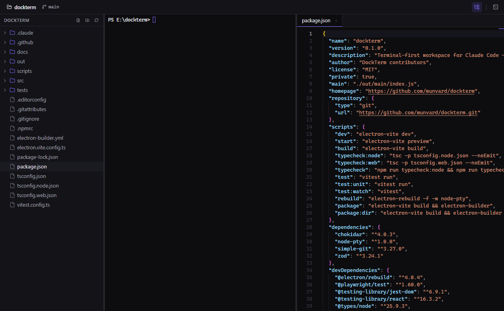
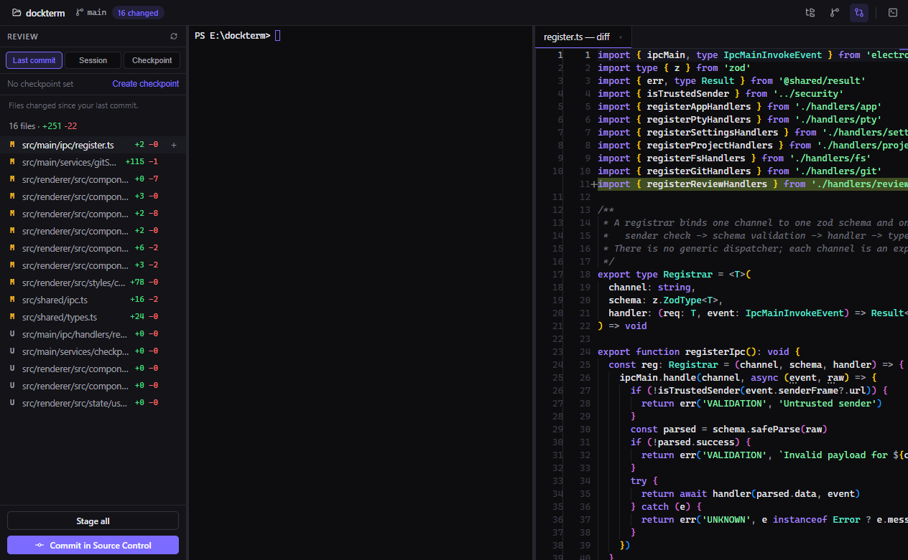
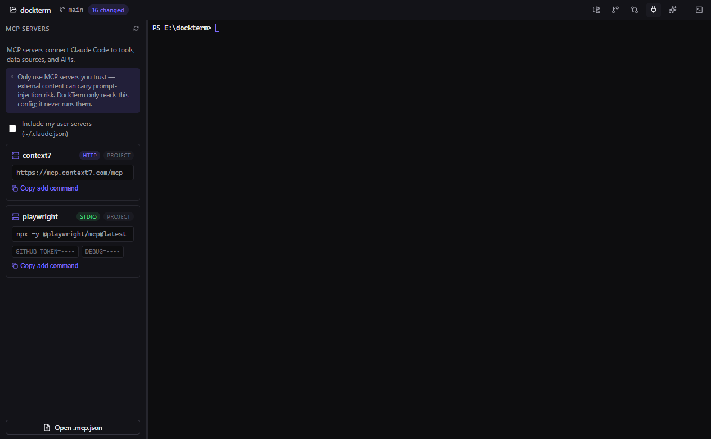
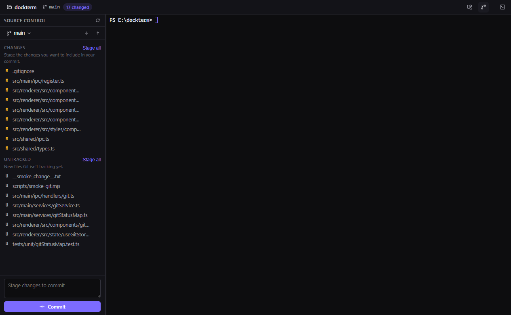

<div align="center">

# DockTerm

### Run `claude`. Everything else stays out of your way.

A terminal-first desktop workspace for [Claude Code](https://www.anthropic.com/claude-code) — with files, Git, MCP, and skills panels that appear only when you need them.

**No telemetry. No accounts. No cloud. Not opt-out — just absent.**

[](LICENSE)




</div>

> **DockTerm is terminal-first. The terminal stays central. Panels only appear when you need them.**

---

## What is DockTerm?

You run Claude Code in a terminal. It edits files, runs commands, changes your repo — and you keep alt-tabbing to an editor just to *see* what happened, to a Git client to review and commit, to a file browser to poke around.

DockTerm is the workspace that was missing. A real terminal stays the hero of the screen — you run `claude` in it, exactly like you do today. When Claude changes things, DockTerm lights up what changed, lets you open a **diff**, **stage**, and **commit** safely, and shows your **MCP servers** and **skills** honestly — all without leaving the window, and without DockTerm ever calling an AI API of its own.

It is **not** an IDE, and it does not try to be. There is no LSP, no extension marketplace, no AI chat. The terminal is never subordinate to a panel.

## Who is it for?

Developers who live in the terminal, use Claude Code, and want quick visual control over files, diffs, Git, and Claude's MCP/skills configuration — without booting a full IDE or trusting a cloud service with their code.

## Why not just iTerm / Windows Terminal?

Those are excellent terminals — and DockTerm doesn't replace them. But a terminal alone can't show you a syntax-highlighted **diff** of what Claude just changed, let you **stage and commit** with one click and a beginner-safe guardrail, or render your `.mcp.json` with secrets masked. DockTerm *wraps* a terminal with exactly those on-demand views.

## Why not VS Code / Cursor?

Because opening a 400 MB IDE to review a three-line change breaks the terminal flow, and because Cursor/Copilot want to *be* the AI. DockTerm's stance is the opposite: **Claude Code is the AI; DockTerm is the calm workspace around it.** No AI calls, no accounts, no cloud sync, no telemetry.

## Core features

| | |
|---|---|
| **Real terminal** | xterm.js + a native PTY (your real shell). Run `claude` here. Resize, search, copy/paste, true-color, unicode. |
| **Mini terminal** | A second toggleable shell for manual commands while the main one is busy. |
| **File tree + editor** | Monaco editor with tabs, dirty indicators, save-with-conflict-guard, and binary/huge-file protection. |
| **Beginner-safe Git** | Grouped status, stage/unstage/discard, commit, push/pull with publish-branch flow, branches — with plain-language hints and confirmations on destructive actions. |
| **Diff review + checkpoints** | See what changed since your last commit, this session, or a pinned **checkpoint**; open a side-by-side diff for any file. |
| **MCP panel** | Read-only view of your configured MCP servers, with secrets masked. |
| **Skills panel** | Browse Claude Code skills & commands; scaffold new ones from templates. |
| **Command palette** | `Ctrl/⌘+Shift+P` for everything, with platform-correct shortcuts. |

## The Claude Code workflow

1. Open a project. The terminal starts in its directory.
2. Run `claude` and let it work.
3. As files change, the top bar shows **`N changed`** and the tree badges update.
4. Open **Review** (or **Source Control**), click a file → read the **diff**.
5. Stage what you trust, write a message, **Commit**. Push when ready.

DockTerm watches the filesystem and Git only — it never reads your prompts, never calls an API, and never sends anything anywhere.



## MCP & Skills visibility

DockTerm parses your Claude Code config **read-only** and **never executes anything**:

- Project `.mcp.json` is shown by default; user-scope `~/.claude.json` only after you opt in.
- Every `env` / `header` value is masked to its **key name**; URLs are shown **host-only** (query tokens stripped).
- A trust warning is always present: *only use MCP servers you trust — external content can carry prompt-injection risk.*



## Git safety

Beginner Git Mode is on by default: short explanations of staged/unstaged/push/branch, and every destructive action shows a confirmation **with the exact command it will run**. Force push is only ever `--force-with-lease`; hard reset and unmerged-branch deletion simply aren't in the UI — that's the terminal's job.



## Installation

> Builds are produced by CI on each release. macOS and Windows builds are **unsigned** in this early V1 — see the bypass notes below. This is a developer tool; treat it accordingly.

1. Go to [**Releases**](../../releases).
2. Download the file for your OS:
   - **Windows** — `DockTerm-<version>-windows-x64.exe` (NSIS installer)
   - **macOS** — `DockTerm-<version>-mac-arm64.dmg` (Apple Silicon) or `-x64.dmg` (Intel)
   - **Linux** — `DockTerm-<version>-linux-x64.AppImage`
3. Install and run.

**macOS Gatekeeper** (unsigned): right-click the app → **Open**, or run `xattr -cr /Applications/DockTerm.app`.
**Windows SmartScreen** (unsigned): **More info → Run anyway**.

## Development

Requires Node 20+ and a C++ toolchain only if your platform lacks a node-pty prebuild (Windows ships prebuilds; macOS too).

```bash
git clone https://github.com/munvard/dockterm
cd dockterm
npm install
npm run dev          # launch the app with HMR
npm run typecheck    # strict TypeScript, no emit
npm test             # unit tests (Vitest)
npm run build        # production bundles
npm run package      # build an installer for your OS
```

See [CONTRIBUTING.md](CONTRIBUTING.md) for the architecture tour and platform notes.

## Security model

- `contextIsolation: true`, `nodeIntegration: false`, `sandbox: true`; production loads over a custom `app://` protocol with a strict CSP and no remote content.
- Every IPC channel is an explicit verb, validated with zod, with a sender check. No generic dispatcher.
- Filesystem access is jailed to the open project (symlink-safe, case-insensitive on Windows). Reading `~/.claude` is a separate, opt-in capability.
- Every `git` invocation runs with `core.hooksPath=` so a malicious repo's hooks can never execute.
- "Run script" buttons **paste into the mini terminal** — visible execution, never a hidden `exec`.
- The telemetry code does not exist.

Full details: [docs/SECURITY_MODEL.md](docs/SECURITY_MODEL.md).

## Roadmap

Shipped in V1: terminal, mini terminal, files, editor, Git, review + checkpoints, MCP & skills panels, command palette, settings. Next up and further out (MCP health checks, live tool lists, per-project profiles) live in [docs/ROADMAP.md](docs/ROADMAP.md).

## Status

**Early, production-focused V1.** The core is real and tested, but this is young software. It is **not** a replacement for iTerm or Cursor, it makes **no** enterprise-security claims, there is **no** MCP marketplace, and the builds are unsigned. Bugs and rough edges are expected — please file them.

## Contributing

Issues and PRs welcome — start with [CONTRIBUTING.md](CONTRIBUTING.md) and the [Code of Conduct](CODE_OF_CONDUCT.md). Security reports: see [SECURITY.md](SECURITY.md).

## License

[MIT](LICENSE) © DockTerm contributors. Built with Electron, xterm.js, Monaco, and simple-git.
